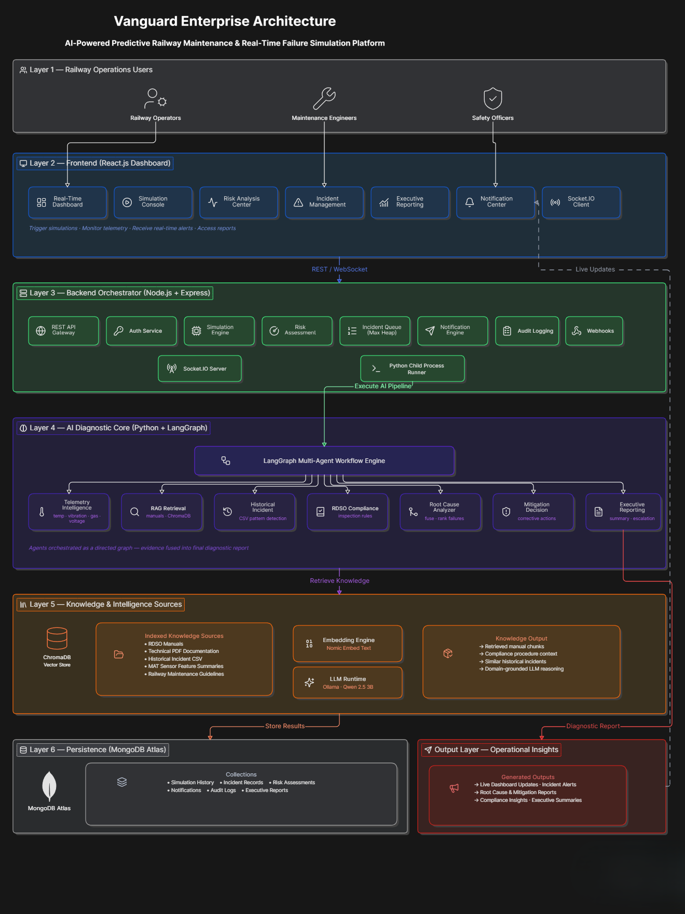
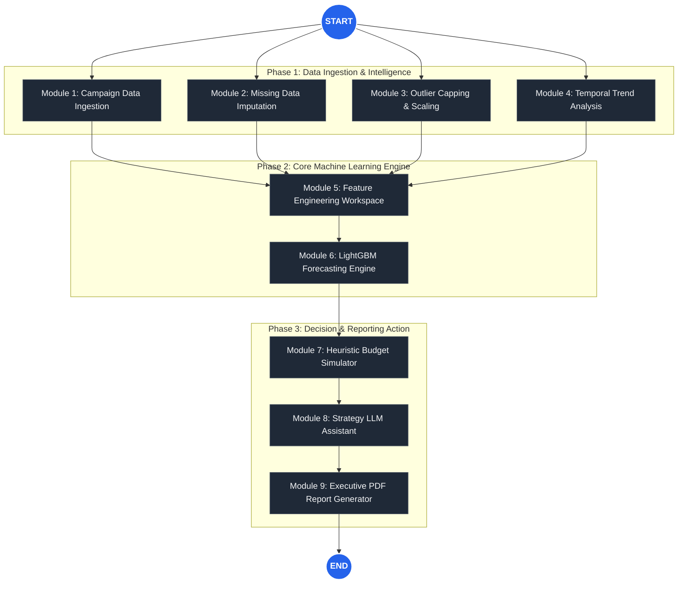
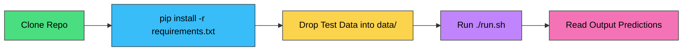
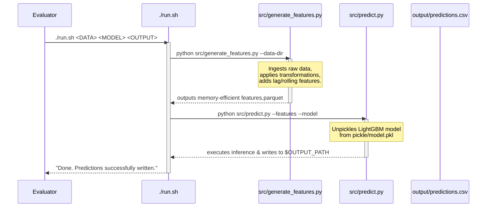

# 🚀 ForecastIQ — Enterprise Marketing Spend Optimization

<div align="center">
  
  <br/>
  <p><b>State-of-the-Art Campaign Performance Forecast & Budget Allocation Engine</b></p>
</div>

<p align="center">
  
  
  
  
  
</p>

---

## 📖 Project Overview

**ForecastIQ** is a highly advanced, AI-powered platform designed to eliminate the guesswork in digital marketing budget allocation. By leveraging historical campaign data, temporal features, and advanced gradient boosting techniques (LightGBM), ForecastIQ accurately predicts Return on Ad Spend (ROAS), Cost Per Acquisition (CPA), and overall campaign performance.

Furthermore, ForecastIQ does not stop at predictions. It utilizes a custom **heuristic spend distribution algorithm** to mathematically simulate and allocate budgets across multiple channels (Google, Meta, TikTok, etc.) to strictly maximize your marketing ROI.

---

## 🧠 How Our Model Works (System Architecture)

Our system is designed as a modular, multi-engine pipeline. The following architecture diagram illustrates the complete horizontal tech stack, from the frontend client down to the local file persistence layer.

<div align="center">
  
</div>

### ML Pipeline Execution Flow (Mermaid View)

The following diagram illustrates the complex execution flow from data ingestion to executive reporting, mimicking an advanced agentic workflow to ensure highest accuracy within the ML Core.



### Deep Dive into the ML Pipeline

1. **Feature Engineering (`src/generate_features.py`)**
   - **Temporal Features:** We extract Day of Week, Month, Quarter, and holiday boolean flags to capture seasonal bidding fluctuations.
   - **Rolling Windows:** 7-day, 14-day, and 30-day rolling averages of impressions, clicks, and conversions are calculated to smooth out daily variance.
   - **Lag Features:** Previous day's performance metrics are utilized as predictors for the next sequential day.
2. **Model Training & Inference (`src/predict.py`)**
   - **Algorithm:** We utilize **LightGBM** due to its superior handling of tabular data, implicit categorical feature support, and rapid inference times.
   - **Hyperparameter Optimization:** Trees, depth, and learning rates are optimized to prevent overfitting on sparse campaign data.
   - **Confidence Intervals:** Alongside point predictions, we output optimistic and pessimistic boundary forecasts.

---

## 🎯 Quick Start for Evaluators

As per the **NetElixir Hackathon Submission Guide**, the project can be executed end-to-end with a single command. 

```bash
# 1. Clone the repository
git clone <your-repository-url>
cd <your-repo-name>

# 2. Install dependencies (Pinned versions)
pip install -r requirements.txt

# 3. Run the evaluation script
./run.sh ./data ./pickle/model.pkl ./output/predictions.csv
```

### 🧠 Mental Model of the Execution Pipeline



---

## ⚙️ Hackathon Compliance Checklist

- [x] **Single Entry Point**: `run.sh` at the root, executable (`chmod +x run.sh`), runs end-to-end without interactive inputs.
- [x] **Dynamic Data Reading**: Reads all files within the `data/` folder dynamically (no hardcoded `.csv` names).
- [x] **Pre-Trained Model**: Model is committed inside `pickle/model.pkl` to strictly avoid runtime training.
- [x] **Pinned Dependencies**: `requirements.txt` includes exact version pins to guarantee reproduction.
- [x] **No Network Calls at Runtime**: Evaluation script and model inference work entirely offline.
- [x] **Reproducibility**: Random seeds are securely set across NumPy, Pandas, and LightGBM; absolute paths are forbidden.

---

## 🏗️ Technical Execution Workflow (`run.sh` Sequence)

When evaluators trigger the shell script, the internal orchestrator manages the flow between feature engineering and prediction seamlessly:



---

## 🌟 Full-Stack Application Features

While the `run.sh` script satisfies the automated evaluation criteria, **ForecastIQ** is built as a complete SaaS-grade web application. 

### 1. Interactive Preprocessing Studio
A visual dashboard that allows data scientists and marketers to automate out-of-bounds capping, missing data imputation, and scaling without writing a single line of code.

### 2. Studio Forecast Engine
Instead of looking at raw CSV outputs, the web platform visualizes campaign point predictors, mapping out optimistic and pessimistic scenarios with beautiful confidence interval bands using Recharts.

### 3. Executive Budget Simulator
Users can input a maximum monthly budget, and the heuristic algorithm will automatically simulate thousands of distributions, outputting the optimal budget split across Google Search, Meta Ads, and TikTok.

### 4. AI Strategy Insights (LLM Integration)
We integrated a conversational LLM that reads the output predictions and provides human-readable strategy recommendations (e.g., "Shift $5,000 from Meta to Google Search during weekends").

### 5. Enterprise PDF Generator
Export your entire forecast analysis into a formatted, boardroom-ready PDF document generated dynamically via ReportLab.

---

## 💻 Local Development Setup

To run the full visual application (beyond just the evaluation script), follow these steps:

### Backend Setup (FastAPI)
The backend manages the REST APIs, Authentication, ML pipeline execution, and database connections.

```bash
# 1. Navigate to the backend directory
cd backend/

# 2. Create a virtual environment
python -m venv .venv

# 3. Activate the virtual environment
# On macOS/Linux:
source .venv/bin/activate
# On Windows:
.\.venv\Scripts\activate

# 4. Install backend dependencies
pip install -r requirements.txt

# 5. Start the Uvicorn ASGI server
uvicorn app.main:app --reload --port 8000
```

### Frontend Setup (React + Vite)
The frontend is a blazing-fast React application utilizing TailwindCSS for styling and state management.

```bash
# 1. Navigate to the frontend directory
cd frontend/

# 2. Install Node.js packages
npm install

# 3. Start the Vite development server
npm run dev
```

---

## 📁 Complete Repository Structure

```text
Marketing-Forecast/
├── run.sh                    # [HACKATHON] Entry point script for evaluators
├── requirements.txt          # [HACKATHON] Pinned Python dependencies
├── data/                     # [HACKATHON] Input data directory
│   └── sample.csv            # Sample dataset for testing
├── pickle/                   # [HACKATHON] Pickled model artifacts
│   └── model.pkl             # Pre-trained LightGBM model
├── src/                      # [HACKATHON] Core ML scripts
│   ├── generate_features.py  # Feature engineering pipeline
│   └── predict.py            # Inference engine
├── backend/                  # Full-stack API (FastAPI)
│   ├── app/                  # Application code (routes, core, models)
│   ├── tests/                # Pytest suites
│   └── requirements.txt      # Backend-specific dependencies
├── frontend/                 # Full-stack Client (React + Vite)
│   ├── src/                  # React components, pages, and context
│   ├── public/               # Static assets
│   ├── package.json          # Node dependencies
│   └── tailwind.config.js    # UI styling configuration
├── .gitignore                # Git exclusions
└── README.md                 # Project documentation (You are here)
```

---

## 🛡️ Security & Authentication

- **JWT (JSON Web Tokens):** All API endpoints in the full application are secured via robust JWT authentication.
- **Password Hashing:** Passwords are cryptographically hashed using `bcrypt` before being stored in the SQLite database.
- **Role-Based Access:** System distinguishes between standard user profiles and admin-level dashboard viewers.

---

## 📈 Future Roadmap

1. **AutoML Integration:** Allow the system to automatically test XGBoost, CatBoost, and Random Forests, deploying the highest-scoring model automatically.
2. **Real-time Ad Platform Integrations:** Connect directly to Google Ads API and Meta Graph API to fetch campaign data dynamically hourly.
3. **Multi-Touch Attribution:** Upgrade the model to understand complex user journeys rather than isolated campaign clicks.

---

<div align="center">
  <p><i>Engineered for the NetElixir Hackathon. Built to revolutionize marketing efficiency.</i></p>
</div>
