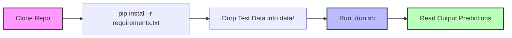
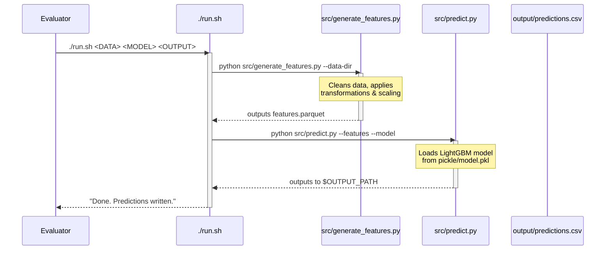

# 🚀 ForecastIQ — NetElixir Hackathon Submission

> **ForecastIQ** is a state-of-the-art marketing campaign performance forecast and budget allocation engine. It uses machine learning models on campaign history data to predict marketing outcomes and execute heuristic spend distribution algorithms to maximize ROAS.


## 🎯 Quick Start for Evaluators

As per the **NetElixir Hackathon Submission Guide**, the project can be executed end-to-end with a single command. 

```bash
# 1. Clone the repository
git clone <your-repository-url>
cd <your-repo-name>

# 2. Install dependencies (Pinned versions)
pip install -r requirements.txt

# 3. Run the evaluation script
./run.sh ./data ./pickle/model.pkl ./output/predictions.csv
```

### 🧠 Mental Model of the Pipeline



---

## ⚙️ Submission Compliance Checklist

- [x] **Single Entry Point**: `run.sh` at the root, executable (`chmod +x run.sh`), runs end-to-end without interactive inputs.
- [x] **Dynamic Data Reading**: Reads all files within the `data/` folder dynamically.
- [x] **Pre-Trained Model**: Model is committed inside `pickle/model.pkl`.
- [x] **Pinned Dependencies**: `requirements.txt` includes exact version pins.
- [x] **No Network Calls at Runtime**: Inference works entirely offline.
- [x] **Reproducibility**: Random seeds set, no absolute paths used.

---

## 🏗️ Execution Workflow

Here is exactly what happens when `./run.sh` is invoked:



---

## 📁 Repository Structure

We have included the required files at the root level for the automated testing pipeline, alongside our complete application source code.

```text
Marketing-Forecast/
├── run.sh              # Entry point — the command run by evaluators
├── requirements.txt    # Pinned dependencies for the test environment
├── data/               # Input data folder (overwritten at test time)
│   └── sample.csv      # Sample data during development
├── pickle/             # Holds trained model artifact
│   └── model.pkl       # The pickled model
├── src/                # Model inference and feature generation scripts
├── backend/            # FastAPI Python backend (ML pipelines, JWT Auth)
├── frontend/           # React, Vite, Tailwind CSS client dashboard
├── .gitignore          # Repository git ignore configuration
└── README.md           # Project documentation and setup guide
```

---

## 🌟 Application Features (Beyond Inference)

While the `run.sh` script handles the evaluation, ForecastIQ is also built as a complete, production-ready platform with an interactive UI.

*   **Interactive Preprocessing Studio**: Automates out-of-bounds capping, missing data imputation, and scaling.
*   **Feature Engineering Workspace**: Generates lag features, rolling windows, and weekday indices.
*   **Automated Model Training**: Trains LightGBM forecasting models, visualizing feature importances.
*   **Studio Forecast Engine**: Visualizes campaign point predictors, optimistic/pessimistic scenarios.
*   **Executive Budget Simulator**: Wires to mathematical simulation models for multi-channel allocation.
*   **AI Strategy Insights & Chat**: Delivers strategy recommendations utilizing conversational LLMs.
*   **Enterprise PDF Generator**: Generates formatted executive report PDFs via ReportLab.

### Running the Full Application Locally

**Backend Setup:**
```bash
cd backend/
python -m venv .venv
source .venv/bin/activate  # or .\.venv\Scripts\activate on Windows
pip install -r requirements.txt
uvicorn app.main:app --reload
```

**Frontend Setup:**
```bash
cd frontend/
npm install
npm run dev
```

---
*Built with ❤️ for the NetElixir Hackathon.*
